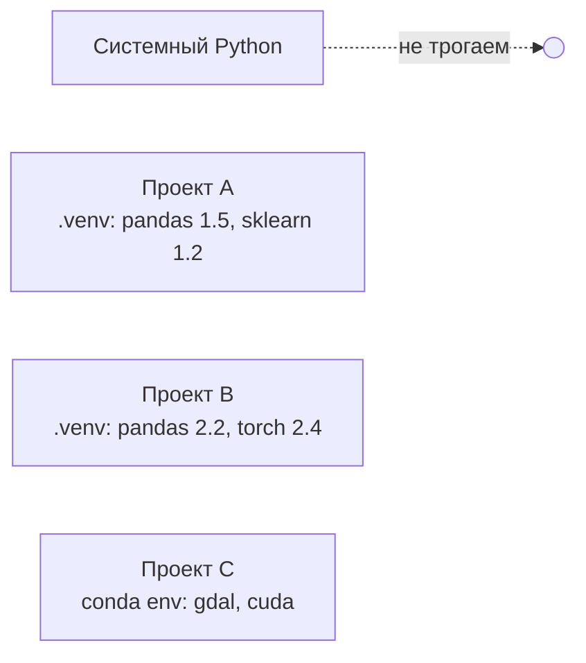
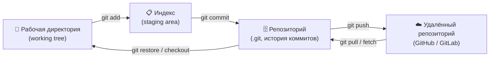
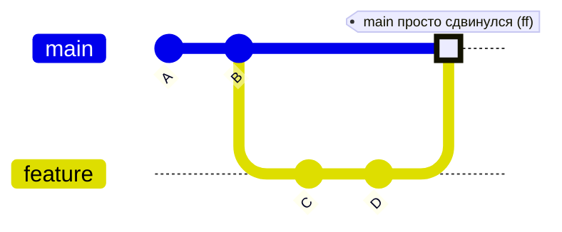
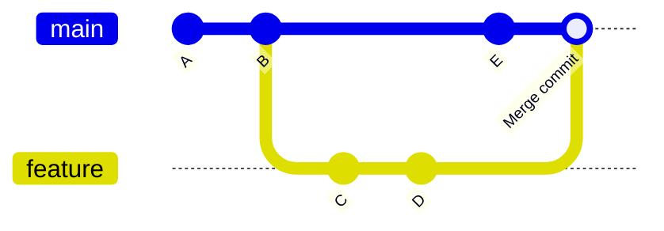
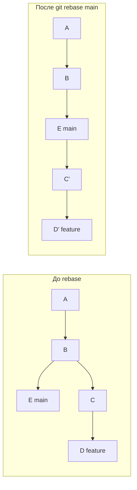
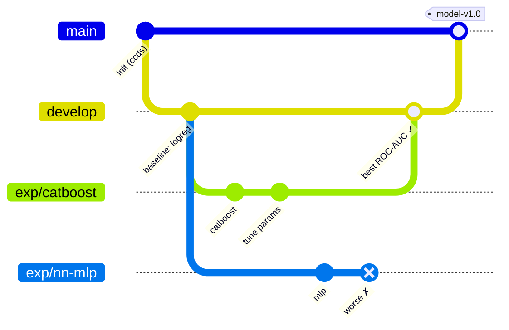

# 🧪 Практикум 1. Рабочее место Data Scientist

> **Цель практикума:** за одно занятие настроить рабочее место, с которым можно сразу начинать работать с данными: изолированное Python-окружение, Git-репозиторий, Jupyter и аккуратная структура проекта.
>
> **Что понадобится:** установленный Python 3.10+ (или Miniforge), Git, терминал (PowerShell на Windows, Terminal на macOS/Linux) и любой редактор (VS Code, PyCharm).

---

## 📑 Содержание

1. [Python-окружение](#1--python-окружение)
   - [venv](#11-создаём-окружение-через-venv) · [conda](#12-создаём-окружение-через-conda) · [Конфигурационные файлы окружений](#13-конфигурационные-файлы-окружений)
   - [pip](#14-pip) · [uv](#15-uv) · [Сравнение менеджеров](#16-сравнение-пакетных-менеджеров)
2. [Git](#2--git)
3. [Jupyter](#3--jupyter)
4. [Структура проекта: Cookiecutter Data Science](#4--структура-проекта-cookiecutter-data-science)
5. [Наборы данных](#5--наборы-данных)
6. [Сквозное задание практикума](#6--сквозное-задание-практикума)
7. [Шпаргалка](#7--шпаргалка)

---

## 1. 🐍 Python-окружение

**Что это.** Виртуальное окружение — это изолированная папка со своим интерпретатором Python и своим набором библиотек, которая не пересекается с системным Python и другими проектами.

**Зачем.** Разным проектам нужны разные версии библиотек (в одном `pandas 1.5`, в другом `pandas 2.2`), а окружение позволяет держать их раздельно и воспроизвести проект на другой машине одной командой.



### 1.1. Создаём окружение через `venv`

`venv` встроен в Python — ничего дополнительно ставить не нужно.

<details open>
<summary><b>🪟 Windows (PowerShell)</b></summary>

```powershell
# 1. Перейти в папку проекта
cd C:\projects\my-ds-project

# 2. Создать окружение (py — лаунчер Python для Windows)
py -3.11 -m venv .venv

# 3. Активировать
.venv\Scripts\Activate.ps1        # PowerShell
# .venv\Scripts\activate.bat      # если используете cmd

# Если PowerShell ругается на ExecutionPolicy — один раз выполнить:
Set-ExecutionPolicy -Scope CurrentUser RemoteSigned

# 4. Проверить, что используется Python из окружения
where python
python --version

# 5. Выйти из окружения
deactivate
```
</details>

<details open>
<summary><b>🐧 Linux / 🍎 macOS (bash / zsh)</b></summary>

```bash
# 0. (Ubuntu/Debian) если модуль venv не установлен
sudo apt install python3-venv

# 1. Перейти в папку проекта
cd ~/projects/my-ds-project

# 2. Создать окружение
python3 -m venv .venv

# 3. Активировать
source .venv/bin/activate

# 4. Проверить
which python
python --version

# 5. Выйти
deactivate
```
</details>

> [!TIP]
> Называйте папку окружения `.venv` и держите её в корне проекта — VS Code и PyCharm находят её автоматически, а в `.gitignore` её легко исключить.

### 1.2. Создаём окружение через `conda`

`conda` — менеджер окружений **и** пакетов, умеющий ставить не только Python-библиотеки, но и системные зависимости (CUDA, GDAL, MKL). Рекомендуемый дистрибутив — **Miniforge** (по умолчанию использует открытый канал `conda-forge`).

**Установка Miniforge**

| ОС | Команда / действие |
|---|---|
| 🪟 Windows | Скачать `Miniforge3-Windows-x86_64.exe` с [github.com/conda-forge/miniforge](https://github.com/conda-forge/miniforge), установить, работать через **Miniforge Prompt** |
| 🍎 macOS | `brew install --cask miniforge` или скрипт ниже |
| 🐧 Linux / 🍎 macOS | `curl -L -O "https://github.com/conda-forge/miniforge/releases/latest/download/Miniforge3-$(uname)-$(uname -m).sh"` → `bash Miniforge3-$(uname)-$(uname -m).sh` |

**Работа с окружением (команды одинаковые на всех ОС)**

```bash
# Подключить conda к оболочке (один раз): bash | zsh | powershell
conda init bash

# Создать окружение с нужной версией Python и библиотеками
conda create -n ds python=3.11 pandas numpy scikit-learn jupyterlab -c conda-forge

# Активировать / деактивировать
conda activate ds
conda deactivate

# Посмотреть все окружения
conda env list

# Установить ещё пакет
conda install -c conda-forge matplotlib

# Сохранить окружение в файл и восстановить его на другой машине
conda env export --from-history > environment.yml
conda env create -f environment.yml

# Обновить окружение по изменённому файлу
conda env update -f environment.yml --prune

# Удалить окружение
conda env remove -n ds
```

> [!NOTE]
> `--from-history` сохраняет только те пакеты, которые вы ставили явно, без системно-зависимых сборок — такой файл переносится между Windows, Linux и macOS.

### 1.3. Конфигурационные файлы окружений

#### `pyvenv.cfg` — создаётся автоматически в `.venv/`

```ini
home = /usr/bin
include-system-site-packages = false
version = 3.11.9
executable = /usr/bin/python3.11
command = /usr/bin/python3 -m venv /home/user/projects/my-ds-project/.venv
```

| Параметр | Значение |
|---|---|
| `home` | Папка базового интерпретатора, от которого создано окружение |
| `include-system-site-packages` | `false` — окружение не видит глобально установленные библиотеки (так и должно быть); `true` — видит |
| `version` | Версия Python в окружении |
| `executable` | Полный путь к базовому интерпретатору |
| `command` | Команда, которой было создано окружение |

#### `requirements.txt` — список зависимостей для pip

```text
pandas==2.2.2          # точная версия
numpy>=1.26,<2.1       # диапазон версий
scikit-learn~=1.5.0    # совместимая версия: >=1.5.0, <1.6
matplotlib             # любая (плохая практика для воспроизводимости)
-e .                   # установить сам проект в режиме разработки
```

#### `environment.yml` — описание conda-окружения

```yaml
name: ds                    # имя окружения
channels:                   # откуда брать пакеты (по порядку приоритета)
  - conda-forge
dependencies:               # conda-пакеты
  - python=3.11
  - pandas=2.2
  - scikit-learn
  - jupyterlab
  - pip
  - pip:                    # пакеты, которых нет в conda, ставятся через pip
      - catboost==1.2.5
```

#### `.condarc` — глобальные настройки conda

Расположение: `~/.condarc` (Windows: `C:\Users\<user>\.condarc`). Посмотреть итоговые настройки: `conda config --show`.

```yaml
channels:
  - conda-forge
channel_priority: strict     # брать пакет из канала с наивысшим приоритетом
auto_activate_base: false    # не активировать base при открытии терминала
show_channel_urls: true      # показывать, из какого канала пакет
envs_dirs:                   # где хранить окружения
  - ~/conda-envs
pkgs_dirs:                   # где хранить кэш скачанных пакетов
  - ~/conda-pkgs
```

Менять настройки удобнее командами, а не руками:

```bash
conda config --add channels conda-forge
conda config --set channel_priority strict
conda config --set auto_activate_base false
```

#### `pyproject.toml` — современный единый файл проекта

```toml
[project]
name = "my-ds-project"           # имя пакета
version = "0.1.0"                # версия
description = "Прогноз оттока"
requires-python = ">=3.11"       # допустимые версии Python
dependencies = [                 # основные зависимости
    "pandas>=2.2",
    "scikit-learn>=1.5",
]

[project.optional-dependencies]  # опциональные группы: pip install ".[viz]"
viz = ["matplotlib", "seaborn"]

[dependency-groups]              # группы для разработки (используются uv)
dev = ["pytest", "ruff", "jupyterlab"]

[build-system]                   # чем собирать пакет
requires = ["hatchling"]
build-backend = "hatchling.build"

[tool.ruff]                      # настройки сторонних инструментов
line-length = 99
```

#### `.python-version` — какую версию Python использовать

Однострочный файл (`3.11`), который читают `uv` и `pyenv`.

### 1.4. `pip`

**pip** — стандартный установщик пакетов Python из репозитория [PyPI](https://pypi.org). Ставит пакеты в **активное** окружение, поэтому сначала активируем `.venv`.

```bash
python -m pip install --upgrade pip           # обновить сам pip

pip install pandas                            # последняя версия
pip install "pandas==2.2.2"                   # конкретная версия
pip install "numpy>=1.26,<2.1"                # диапазон
pip install pandas scikit-learn matplotlib    # несколько сразу
pip install -r requirements.txt               # всё из файла
pip install -e .                              # свой проект в режиме разработки (из pyproject.toml)
pip install -U scikit-learn                   # обновить пакет

pip list                                      # что установлено
pip show pandas                               # информация о пакете
pip freeze > requirements.txt                 # зафиксировать текущие версии
pip uninstall pandas                          # удалить
```

> [!TIP]
> Пишите `python -m pip ...` вместо `pip ...` — так гарантированно используется pip того Python, который сейчас активен.

**Где лежат конфигурационные файлы pip** (`pip.conf` на Linux/macOS, `pip.ini` на Windows):

| Уровень | 🪟 Windows | 🐧 Linux | 🍎 macOS |
|---|---|---|---|
| Глобальный | `C:\ProgramData\pip\pip.ini` | `/etc/pip.conf` | `/Library/Application Support/pip/pip.conf` |
| Пользователь | `%APPDATA%\pip\pip.ini` | `~/.config/pip/pip.conf` | `~/Library/Application Support/pip/pip.conf` |
| Окружение | `.venv\pip.ini` | `.venv/pip.conf` | `.venv/pip.conf` |

Более узкий уровень перекрывает более широкий. Проверить, какие файлы реально читаются: `pip config debug`, посмотреть настройки: `pip config list`.

```ini
[global]
index-url = https://pypi.org/simple             ; основной репозиторий пакетов
extra-index-url = https://download.pytorch.org/whl/cpu  ; дополнительный
trusted-host = nexus.company.local              ; доверять хосту без проверки SSL (корп. зеркало)
timeout = 60                                    ; таймаут сети, сек
require-virtualenv = true                       ; запретить установку вне venv — спасает системный Python
no-cache-dir = false                            ; использовать кэш

[install]
upgrade-strategy = only-if-needed
```

То же самое можно задать командой: `pip config set global.require-virtualenv true` или переменной окружения `PIP_INDEX_URL=...`.

### 1.5. `uv`

**uv** — очень быстрый (написан на Rust) менеджер пакетов и проектов от Astral: заменяет `pip`, `venv`, `pip-tools`, `pipx` и `pyenv` одним инструментом и умеет сам скачивать нужную версию Python.

**Установка**

```bash
# 🐧 Linux / 🍎 macOS
curl -LsSf https://astral.sh/uv/install.sh | sh
# или: brew install uv

# 🪟 Windows (PowerShell)
powershell -ExecutionPolicy ByPass -c "irm https://astral.sh/uv/install.ps1 | iex"

# Любая ОС, если уже есть Python
pip install uv      # или pipx install uv
```

**Режим «проекта» (рекомендуемый)** — uv сам ведёт `pyproject.toml`, `uv.lock` и `.venv`:

```bash
uv init my-ds-project && cd my-ds-project   # создаёт pyproject.toml, .python-version, main.py
uv python install 3.11                      # скачать Python 3.11 (если его нет в системе)
uv python pin 3.11                          # записать версию в .python-version

uv add pandas scikit-learn                  # добавить зависимости (+ обновит uv.lock и .venv)
uv add "numpy<2.1"                          # с ограничением версии
uv add --dev jupyterlab ruff pytest         # dev-зависимости → [dependency-groups].dev
uv remove seaborn                           # удалить

uv sync                                     # привести .venv в точное соответствие uv.lock
uv lock --upgrade                           # обновить версии в lock-файле
uv tree                                     # дерево зависимостей

uv run python train.py                      # запустить в окружении проекта без активации
uv run jupyter lab                          # запустить Jupyter из окружения проекта
```

**Режим «как pip»** — если проект уже живёт на `requirements.txt`:

```bash
uv venv                                     # создать .venv
uv pip install -r requirements.txt          # то же, что pip, но в разы быстрее
uv pip freeze > requirements.txt
uv export --format requirements-txt > requirements.txt   # выгрузить из uv.lock
```

**Конфигурационные файлы uv**

| Файл | Где лежит | Зачем |
|---|---|---|
| `pyproject.toml` → секция `[tool.uv]` | корень проекта | Настройки uv для проекта |
| `uv.toml` | корень проекта | То же, но отдельным файлом (приоритетнее `[tool.uv]`) |
| `uv.toml` пользователя | Linux/macOS: `~/.config/uv/uv.toml`<br>Windows: `%APPDATA%\uv\uv.toml` | Общие настройки для всех проектов |
| `uv.lock` | корень проекта | Точные версии всех зависимостей. **Генерируется автоматически, руками не правим, коммитим в Git** |
| `.python-version` | корень проекта | Версия Python для проекта |

```toml
# pyproject.toml
[tool.uv]
default-groups = ["dev"]            # какие группы ставить при uv sync
python-preference = "managed"       # предпочитать Python, скачанный uv, а не системный
link-mode = "copy"                  # копировать файлы из кэша (полезно на Windows/OneDrive)

# Дополнительный индекс пакетов, например для PyTorch без CUDA
[[tool.uv.index]]
name = "pytorch-cpu"
url = "https://download.pytorch.org/whl/cpu"
explicit = true                     # использовать только для явно указанных пакетов

[tool.uv.sources]
torch = { index = "pytorch-cpu" }   # torch брать из индекса pytorch-cpu
```

### 1.6. Сравнение пакетных менеджеров

| Критерий | `pip` (+ `venv`) | `uv` | `conda` |
|---|---|---|---|
| Что это | Стандартный установщик Python | Менеджер пакетов, окружений и версий Python | Менеджер пакетов и окружений для любых языков |
| Написан на | Python | Rust | Python |
| Скорость | 🐢 базовая | 🚀 в 10–100 раз быстрее pip | 🐢 медленная (с `libmamba` — заметно быстрее) |
| Источник пакетов | PyPI | PyPI (+ любые индексы) | conda-forge, defaults |
| Создание окружений | через `venv` | `uv venv` / автоматически | `conda create` |
| Установка версий Python | ❌ | ✅ `uv python install` | ✅ `python=3.11` |
| Lock-файл | ❌ (только `pip freeze`) | ✅ `uv.lock`, кроссплатформенный | ⚠️ через `conda-lock` |
| Не-Python зависимости (CUDA, GDAL, MKL) | ❌ | ❌ | ✅ |
| Файлы проекта | `requirements.txt`, `pyproject.toml` | `pyproject.toml`, `uv.lock` | `environment.yml` |
| Глобальный конфиг | `pip.conf` / `pip.ini` | `uv.toml` | `.condarc` |
| Когда выбирать | Простые скрипты, уже готовые проекты | Новые проекты — по умолчанию | Сложные бинарные зависимости, GPU, геоданные |

> [!IMPORTANT]
> Не смешивайте `conda install` и `pip install` в одном окружении без необходимости: сначала ставьте всё возможное через conda, а pip — только для того, чего нет в conda-forge.

---

## 2. 🌳 Git

**Git** — распределённая система контроля версий: она хранит историю изменений файлов проекта в виде «снимков» (коммитов), позволяет откатываться к любому из них и параллельно работать в разных ветках. Для Data Science это способ не потерять рабочую версию кода, воспроизвести эксперимент и работать над проектом командой.

### 2.1. Три зоны Git



- **Рабочая директория** — файлы, которые вы видите и редактируете.
- **Индекс (staging area)** — «черновик» следующего коммита: сюда вы складываете только те изменения, которые хотите зафиксировать.
- **Репозиторий** — папка `.git` со всей историей.

### 2.2. Первичная настройка и инициализация

```bash
# Один раз на компьютере
git config --global user.name  "Ivan Petrov"
git config --global user.email "ivan@example.com"
git config --global init.defaultBranch main      # основная ветка будет называться main
git config --global core.editor "code --wait"    # редактор для сообщений коммитов (VS Code)
git config --global core.autocrlf true           # 🪟 Windows: CRLF ↔ LF
git config --global core.autocrlf input          # 🐧/🍎 Linux, macOS

# Новый репозиторий в папке проекта
cd my-ds-project
git init

# Или скачать существующий
git clone https://github.com/user/repo.git
```

### 2.3. Конфигурационные файлы Git

| Файл | Где | Что задаёт |
|---|---|---|
| Системный конфиг | Linux/macOS: `/etc/gitconfig`<br>Windows: `C:\Program Files\Git\etc\gitconfig` | Настройки для всех пользователей (`git config --system`) |
| Глобальный конфиг | `~/.gitconfig` (Windows: `C:\Users\<user>\.gitconfig`) | Ваши настройки: имя, почта, алиасы (`--global`) |
| Локальный конфиг | `.git/config` | Настройки конкретного репозитория: remotes, ветки (`--local`, самый приоритетный) |
| `.gitignore` | корень проекта (коммитится) | Какие файлы Git не отслеживает |
| `.gitattributes` | корень проекта (коммитится) | Окончания строк, Git LFS, diff для бинарных файлов |
| `.git/info/exclude` | внутри `.git` | Личный `.gitignore`, не попадает в репозиторий |

Посмотреть все настройки и откуда они взялись: `git config --list --show-origin`.

**Пример `~/.gitconfig`**

```ini
[user]
    name = Ivan Petrov
    email = ivan@example.com
[init]
    defaultBranch = main
[core]
    editor = code --wait
    autocrlf = input
[pull]
    rebase = false          ; git pull делает merge, а не rebase
[alias]
    st = status -sb
    lg = log --oneline --graph --decorate --all
```

**`.gitignore` для Data Science проекта**

```gitignore
# Окружения
.venv/
env/
__pycache__/

# Jupyter
.ipynb_checkpoints/

# Данные и модели — не храним в Git (используйте DVC / облачное хранилище)
data/
models/*.pkl
*.parquet
*.csv

# Секреты
.env

# IDE и ОС
.vscode/
.idea/
.DS_Store
```

> [!WARNING]
> Никогда не коммитьте пароли, токены и большие датасеты. Удалить файл из истории Git потом очень сложно.

### 2.4. Индекс и коммиты: `git add`, `git commit`

```bash
git status                       # что изменено, что в индексе
git add src/features.py          # добавить файл в индекс
git add .                        # добавить все изменения в текущей папке
git add -p                       # добавлять изменения по кусочкам (интерактивно)

git restore --staged file.py     # убрать файл из индекса (изменения остаются)
git restore file.py              # ⚠️ откатить изменения файла в рабочей директории

git commit -m "Добавил очистку пропусков в датасете"
git commit --amend -m "Новое сообщение"   # исправить ПОСЛЕДНИЙ коммит (если ещё не запушен)
```

> [!TIP]
> Хороший коммит — одно логическое изменение и понятное сообщение в повелительном/прошедшем времени: `Add feature scaling`, `Fix data leakage in CV`.

### 2.5. Смотрим историю: `log`, `show`, `diff`

```bash
git log                                  # полная история текущей ветки
git log --oneline                        # кратко: хеш + сообщение
git log --oneline --graph --all          # граф всех веток
git log -n 5                             # последние 5 коммитов
git log --author="Ivan"                  # коммиты автора
git log -p src/features.py               # история файла вместе с изменениями
git log --follow -- src/features.py      # история файла даже после переименования

git show a1b2c3d                         # что изменилось в коммите
git show HEAD                            # последний коммит
git show HEAD~2:src/train.py             # содержимое файла 2 коммита назад

git diff                                 # рабочая директория vs индекс (что ещё не добавлено)
git diff --staged                        # индекс vs последний коммит (что войдёт в коммит)
git diff main feature/eda                # разница между ветками
git diff HEAD~3 HEAD                     # разница между коммитами
git diff --name-only main feature/eda    # только имена изменённых файлов
git diff --name-status main feature/eda  # имена + тип изменения (A/M/D)
git diff --stat                          # сколько строк изменено по файлам

git blame src/train.py                   # кто и когда менял каждую строку
```

### 2.6. Ветки и `HEAD`

- **Ветка** — это просто подвижный указатель на коммит. При новом коммите указатель сдвигается вперёд.
- **`main`** — основная ветка, в ней лежит стабильная рабочая версия проекта.
- **`HEAD`** — указатель на то, «где вы сейчас»: обычно он указывает на текущую ветку. Если переключиться на конкретный коммит, получится **detached HEAD** — коммиты в таком состоянии легко потерять.
- `HEAD~1` — родитель текущего коммита, `HEAD~3` — три коммита назад.

```bash
git branch                       # список локальных веток (* — текущая)
git branch -a                    # включая удалённые
git checkout -b feature/eda      # создать ветку и переключиться на неё
git switch -c feature/eda        # то же самое, современная команда
git checkout main                # переключиться на main (или: git switch main)
git branch -d feature/eda        # удалить слитую ветку
git branch -D feature/eda        # удалить принудительно (даже не слитую)
```

### 2.7. `git merge` и стратегии слияния

```bash
git checkout main
git merge feature/eda
```

| Вариант | Команда | Что происходит | Когда использовать |
|---|---|---|---|
| **Fast-forward** | `git merge feature` (если `main` не ушёл вперёд) | Указатель `main` просто сдвигается на последний коммит ветки. Нового коммита нет, история линейная | Небольшие изменения, личные ветки |
| **Fast-forward only** | `git merge --ff-only feature` | Сливает только если возможен fast-forward, иначе — ошибка | Когда нужна строго линейная история |
| **No fast-forward** | `git merge --no-ff feature` | Всегда создаёт merge-коммит, даже если возможен fast-forward. Видно, что была отдельная ветка | Gitflow, слияние фич |
| **Трёхсторонний (3-way, стратегия `ort`)** | `git merge feature` (если обе ветки ушли вперёд) | Git находит общего предка и создаёт merge-коммит с двумя родителями | Стандартный случай при параллельной работе |
| **Squash** | `git merge --squash feature` → `git commit` | Все коммиты ветки «сплющиваются» в один новый коммит в `main` | Много мелких «грязных» коммитов в эксперименте |
| **Опции разрешения конфликтов** | `git merge -X ours feature` / `-X theirs` | При конфликте автоматически берётся наша / их версия | Осторожно, только если уверены |

**Fast-forward:**



**No fast-forward / трёхстороннее слияние:**



**Если возник конфликт:**

```bash
git status                  # какие файлы в конфликте
# открыть файл, найти блоки <<<<<<< ======= >>>>>>> и оставить нужный вариант
git add conflicted_file.py
git commit                  # завершить слияние
# или отменить слияние целиком:
git merge --abort
```

### 2.8. `git reset`: `--soft`, `--mixed`, `--hard`

`git reset <коммит>` переносит текущую ветку (и `HEAD`) на указанный коммит. Отличаются режимы тем, что происходит с индексом и файлами:

| Режим | Ветка/HEAD | Индекс | Рабочие файлы | Типичный сценарий |
|---|---|---|---|---|
| `--soft` | ✅ сдвигается | сохраняется (изменения остаются «добавленными») | сохраняются | «Склеить» последние коммиты: `git reset --soft HEAD~3` → `git commit` |
| `--mixed` (по умолчанию) | ✅ сдвигается | очищается | сохраняются | Отменить коммит, но оставить правки в файлах |
| `--hard` | ✅ сдвигается | очищается | ❌ **перезаписываются** | Полностью выбросить изменения и вернуться к коммиту |

```bash
git reset --soft HEAD~1     # отменить последний коммит, изменения остаются в индексе
git reset HEAD~1            # отменить коммит, изменения остаются в файлах
git reset --hard HEAD~1     # ⚠️ отменить коммит и УДАЛИТЬ изменения
git reset --hard origin/main  # ⚠️ сделать локальную ветку точно как на сервере
```

> [!TIP]
> **Спасательный круг — `git reflog`.** Он показывает все перемещения `HEAD`. Если сделали неудачный `reset` или `rebase`, найдите в `reflog` нужный хеш и выполните `git reset --hard <хеш>`. Но незакоммиченные изменения после `--hard` не восстановить никак.

### 2.9. `git rebase` и `git rebase -i`

**`git rebase`** «переносит» ваши коммиты так, будто ветка была начата от более свежего состояния `main`. История получается линейной, без merge-коммитов.

```bash
git checkout feature/eda
git rebase main             # переписать коммиты feature/eda поверх актуального main
# при конфликте: исправить → git add → git rebase --continue
# отменить всё: git rebase --abort
```



Обратите внимание: `C'` и `D'` — **новые** коммиты с новыми хешами.

**Интерактивный rebase** — способ «причесать» историю перед слиянием:

```bash
git rebase -i HEAD~4        # редактировать последние 4 коммита
```

Откроется редактор со списком:

```text
pick   a1b2c3d Загрузка данных
reword d4e5f6a фикс                      # изменить сообщение коммита
squash 7a8b9c0 ещё фикс                  # склеить с предыдущим, сообщения объединить
fixup  1f2e3d4 опечатка                  # склеить с предыдущим, сообщение выбросить
```

| Команда | Сокращение | Действие |
|---|---|---|
| `pick` | `p` | Оставить коммит как есть |
| `reword` | `r` | Оставить, но изменить сообщение |
| `edit` | `e` | Остановиться на коммите, чтобы поправить его содержимое |
| `squash` | `s` | Объединить с предыдущим коммитом, сохранив оба сообщения |
| `fixup` | `f` | Объединить с предыдущим, сообщение текущего отбросить |
| `drop` | `d` | Удалить коммит |

Порядок строк можно менять — тогда изменится порядок коммитов.

### 2.10. ⚠️ Почему `reset` и `rebase` — опасные команды

1. **Они переписывают историю.** После `rebase` или `reset` старые коммиты заменяются новыми с другими хешами. Если коллеги уже скачали старую историю, их ветки разойдутся с вашей, и при следующем `pull` получится путаница с дублирующимися коммитами и конфликтами.
2. **Требуют принудительного push.** Сервер не примет переписанную историю обычным `git push`, нужен `git push --force`, который **затирает** чужие коммиты на сервере, если кто-то успел запушить.
3. **`reset --hard` безвозвратно удаляет незакоммиченные изменения** — их нет ни в истории, ни в `reflog`.

**Золотые правила:**

- ❌ Не делайте `rebase` / `reset` для веток, которые уже запушены и которыми пользуются другие (`main`, `develop`).
- ✅ Переписывайте историю только в **своих локальных** ветках до публикации.
- ✅ Если без force-push не обойтись — используйте `git push --force-with-lease`: он откажется пушить, если на сервере появились чужие коммиты.
- ✅ Перед рискованной операцией сделайте страховочную ветку: `git branch backup/feature-eda`.

### 2.11. Кейс: перенести ветку из одного репозитория в другой

**Задача:** в репозитории `repo-A` есть ветка `feature/churn-model`, её нужно перенести в репозиторий `repo-B`.

```bash
cd repo-A
git checkout feature/churn-model
git remote -v                       # смотрим, куда сейчас указывает origin
# origin  https://github.com/team/repo-A.git (fetch)
# origin  https://github.com/team/repo-A.git (push)
```

**Вариант 1. Перенаправить `origin` (`git remote set-url`)** — подходит, если локальная копия дальше будет работать только с `repo-B`:

```bash
git remote set-url origin https://github.com/team/repo-B.git
git remote -v                               # проверяем, что адрес изменился
git push -u origin feature/churn-model      # ветка появилась в repo-B
```

**Вариант 2. Добавить второй remote (безопаснее)** — `repo-A` остаётся доступным:

```bash
git remote add repo-b https://github.com/team/repo-B.git
git push repo-b feature/churn-model                    # под тем же именем
git push repo-b feature/churn-model:experiments/churn  # под другим именем
git push repo-b --tags                                  # при необходимости — теги
```

> [!NOTE]
> Если у `repo-B` своя, не связанная с `repo-A` история, при слиянии ветки в `main` репозитория B Git скажет `refusing to merge unrelated histories`. Тогда в `repo-B` выполните `git merge experiments/churn --allow-unrelated-histories` или перенесите отдельные коммиты через `git cherry-pick <хеш>`.

### 2.12. Gitflow


*Схема: Vincent Driessen, «A successful Git branching model», [nvie.com](https://nvie.com/posts/a-successful-git-branching-model/), лицензия CC BY-SA.*

**Логика Gitflow.** Есть две постоянные ветки и три вида временных:

| Ветка | Откуда создаётся | Куда сливается | Назначение |
|---|---|---|---|
| `main` (`master`) | — | — | Только стабильные релизы, каждый коммит помечен тегом версии (`v1.2`) |
| `develop` | `main` | — | Интеграционная ветка: здесь собираются готовые фичи для следующего релиза |
| `feature/*` | `develop` | `develop` | Разработка одной фичи |
| `release/*` | `develop` | `main` и `develop` | Подготовка релиза: только багфиксы, версия, документация |
| `hotfix/*` | `main` | `main` и `develop` | Срочное исправление ошибки в продакшене |

```bash
# Типичный цикл фичи
git checkout -b feature/new-features develop
# ... коммиты ...
git checkout develop
git merge --no-ff feature/new-features
git branch -d feature/new-features
git push origin develop
```

**Упрощения для маленького проекта (1–3 человека).** Полный Gitflow избыточен, достаточно одного из вариантов:

1. **GitHub Flow** — только `main` + короткие `feature/*` ветки. Каждая фича → Pull Request → ревью → merge в `main`. Релизы отмечаются тегами.
2. **`main` + `develop` без `release/*` и `hotfix/*`** — если нужен отдельный «стабильный» `main`, а исправления делаются прямо в `develop` и выкатываются вместе с очередным merge.

**Gitflow для экспериментов Data Science**



Практические правила:

- **Эксперимент = ветка** от `develop` с говорящим именем: `exp/2026-10-catboost-tuning`, `exp/text-features-tfidf`.
- **В `develop` сливаем только удачные эксперименты** (метрика лучше бейзлайна, код приведён в порядок, лучше через `--squash` или после `rebase -i`).
- **Неудачные эксперименты не удаляем бесследно** — ставим тег `git tag archive/exp-nn-mlp exp/nn-mlp` и удаляем ветку. Отрицательный результат — тоже результат.
- **`main` = модель, которая сейчас в работе**, каждая версия помечена тегом `model-v1.0`.
- **Данные и веса моделей не храним в Git** — для них DVC или облачное хранилище, а метрики и параметры логируем в MLflow / W&B, указывая хеш коммита.
- **Ноутбуки перед коммитом очищаем от выводов**: `pip install nbstripout && nbstripout --install` — иначе diff превратится в мусор из base64-картинок.

---

## 3. 📓 Jupyter

**Jupyter** — интерактивная среда, где код, его результаты, графики и текстовые пояснения живут в одном документе-ноутбуке (`.ipynb`). Код выполняется **ядром (kernel)** — отдельным процессом Python, поэтому важно, чтобы ядро было из окружения вашего проекта.

- **JupyterLab** — современный интерфейс (вкладки, файловый менеджер, терминал). Используем его.
- **Jupyter Notebook** — классический упрощённый интерфейс.

### 3.1. Установка

```bash
# pip (в активированном .venv)
pip install jupyterlab ipykernel

# uv
uv add --dev jupyterlab ipykernel

# conda
conda install -c conda-forge jupyterlab ipykernel
```

### 3.2. Создание и запуск из терминала

```bash
# Запуск JupyterLab (откроется браузер, адрес и токен будут в терминале)
jupyter lab
uv run jupyter lab                          # то же через uv, без активации окружения

# Полезные параметры запуска
jupyter lab --notebook-dir=./notebooks      # корневая папка
jupyter lab --port 8889                     # другой порт
jupyter lab --no-browser                    # не открывать браузер (удалённый сервер)

# Классический интерфейс
jupyter notebook

# Создать пустой ноутбук из терминала и сразу открыть его
python -c "import nbformat as nbf; nbf.write(nbf.v4.new_notebook(), 'notebooks/1.0-ip-eda.ipynb')"
jupyter lab notebooks/1.0-ip-eda.ipynb

# Выполнить ноутбук целиком и сохранить результат / сконвертировать в HTML
jupyter nbconvert --to notebook --execute notebooks/1.0-ip-eda.ipynb --output 1.0-ip-eda-run.ipynb
jupyter nbconvert --to html notebooks/1.0-ip-eda.ipynb

# Посмотреть запущенные серверы и остановить
jupyter server list
# Остановка — Ctrl+C в терминале, где запущен сервер
```

### 3.3. Ядро из своего окружения

Если Jupyter установлен глобально, а библиотеки — в `.venv`, нужно зарегистрировать окружение как ядро:

```bash
# в активированном окружении проекта
python -m ipykernel install --user --name my-ds-project --display-name "Python (my-ds-project)"

jupyter kernelspec list                       # список ядер и пути к ним
jupyter kernelspec uninstall my-ds-project    # удалить ядро
```

После этого в JupyterLab: **Kernel → Change Kernel → Python (my-ds-project)**.

### 3.4. Конфигурационные файлы Jupyter

Узнать все пути, где Jupyter ищет настройки, данные и ядра: `jupyter --paths`. Папка пользователя: `~/.jupyter` (Windows: `C:\Users\<user>\.jupyter`), её можно переопределить переменной `JUPYTER_CONFIG_DIR`.

| Файл | Как создать | Что настраивает |
|---|---|---|
| `jupyter_server_config.py` | `jupyter server --generate-config` | Сервер: порт, IP, корневая папка, браузер (используется JupyterLab 4) |
| `jupyter_lab_config.py` | `jupyter lab --generate-config` | Настройки приложения JupyterLab |
| `jupyter_notebook_config.py` | `jupyter notebook --generate-config` | Классический Notebook |
| `jupyter_server_config.json` | `jupyter server password` | Хеш пароля для входа |
| `lab/user-settings/**/*.jupyterlab-settings` | Settings → Settings Editor | Тема, шрифт, автосохранение, горячие клавиши (JSON) |
| `kernels/<имя>/kernel.json` | `python -m ipykernel install ...` | Какой интерпретатор запускает ядро |
| `~/.ipython/profile_default/ipython_config.py` | `ipython profile create` | Поведение IPython внутри ядра |
| `~/.ipython/profile_default/startup/*.py` | вручную | Код, выполняемый при старте каждого ядра (импорты) |

**Пример `jupyter_server_config.py`**

```python
c.ServerApp.ip = "127.0.0.1"          # слушать только локальный адрес (безопасно)
c.ServerApp.port = 8888               # порт
c.ServerApp.open_browser = True       # открывать браузер при запуске
c.ServerApp.root_dir = "/home/user/projects"   # корневая папка в файловом браузере
c.FileContentsManager.delete_to_trash = True   # удалять файлы в корзину, а не насовсем
```

**Пример `kernel.json`**

```json
{
  "argv": ["/home/user/projects/my-ds-project/.venv/bin/python",
           "-m", "ipykernel_launcher", "-f", "{connection_file}"],
  "display_name": "Python (my-ds-project)",
  "language": "python"
}
```

### 3.5. Полезные «магии» в ноутбуке

```python
%load_ext autoreload
%autoreload 2          # автоматически подхватывать изменения в .py модулях проекта

%pip install seaborn   # установить пакет именно в ядро ноутбука
%timeit df.groupby("city").size()   # замер времени
%matplotlib inline     # графики внутри ноутбука
```

> [!TIP]
> Ноутбук — для исследования. Как только код стал повторно используемым (загрузка данных, фичи, обучение), переносите его в `.py`-модули проекта и импортируйте в ноутбук. `%autoreload 2` делает этот процесс удобным.

---

## 4. 🗂️ Структура проекта: Cookiecutter Data Science

**Cookiecutter Data Science (CCDS)** — генератор шаблона проекта от DrivenData: одна команда создаёт готовую, общепринятую структуру папок и файлов для DS-проекта.

**Зачем он нужен:**

- 🧭 **Единообразие.** Любой человек, открывший проект, сразу знает, где сырые данные, где ноутбуки, где код обучения.
- 🔁 **Воспроизводимость.** Сырые данные неизменны, все преобразования — в коде, поэтому результат можно пересобрать с нуля.
- ⏱️ **Экономия времени.** Не нужно каждый раз придумывать структуру, `.gitignore`, `Makefile`, настройки линтера.
- 🤝 **Командная работа.** Меньше конфликтов и споров «куда положить файл».

### 4.1. Установка

Начиная с версии 2 используется собственная утилита `ccds` (а не `cookiecutter`). Поскольку это инструмент для всех проектов, его ставят глобально через `pipx` или `uv tool`:

```bash
# Рекомендуемый способ
pipx install cookiecutter-data-science

# Через uv
uv tool install cookiecutter-data-science

# Через pip (в любое окружение)
pip install cookiecutter-data-science

# Через conda
conda install -c conda-forge cookiecutter-data-science
```

### 4.2. Инициализация проекта

```bash
cd ~/projects
ccds
```

Утилита задаст несколько вопросов (в скобках — значение по умолчанию, Enter — согласиться):

```text
project_name (project_name): Churn Prediction
repo_name (churn_prediction):
module_name (churn_prediction):
author_name (Your name (or your organization/company/team)): Ivan Petrov
description (A short description of the project.): Прогноз оттока клиентов
python_version_number (3.10): 3.11
Select dataset_storage: 1 - none, 2 - azure, 3 - s3, 4 - gcs  → 1
Select environment_manager: virtualenv / conda / pipenv / uv / none → uv
Select dependency_file: requirements.txt / pyproject.toml / environment.yml / Pipfile → pyproject.toml
Select pydata_packages: none / basic → basic
Select linting_and_formatting: ruff / flake8+black+isort → ruff
Select open_source_license: No license / MIT / BSD-3-Clause → MIT
Select docs: mkdocs / none → none
Select include_code_scaffold: Yes / No → Yes
```

> Точный набор вопросов зависит от версии `ccds` — читайте подсказки в терминале.

### 4.3. Что получится

```text
churn_prediction/
├── LICENSE
├── Makefile             <- Команды: make requirements, make data, make lint, ...
├── README.md            <- Описание проекта для людей
├── data
│   ├── external         <- Данные из сторонних источников
│   ├── interim          <- Промежуточные результаты преобразований
│   ├── processed        <- Финальные датасеты для обучения
│   └── raw              <- Исходные данные. НИКОГДА НЕ ИЗМЕНЯЮТСЯ
├── docs                 <- Документация
├── models               <- Обученные модели, предсказания
├── notebooks            <- Ноутбуки: 1.0-ip-initial-data-exploration.ipynb
├── pyproject.toml       <- Метаданные проекта и настройки инструментов
├── references           <- Словари данных, статьи, пояснения
├── reports
│   └── figures          <- Графики для отчётов
└── churn_prediction     <- Исходный код проекта (Python-пакет)
    ├── __init__.py
    ├── config.py        <- Пути и общие настройки
    ├── dataset.py       <- Загрузка / генерация данных
    ├── features.py      <- Построение признаков
    ├── modeling
    │   ├── __init__.py
    │   ├── train.py     <- Обучение модели
    │   └── predict.py   <- Инференс
    └── plots.py         <- Визуализации
```

**Соглашение об именах ноутбуков:** `<номер>-<инициалы>-<описание>.ipynb`, например `1.0-ip-initial-data-exploration.ipynb`, `2.1-ip-feature-engineering.ipynb`. Номер задаёт порядок, инициалы — автора.

### 4.4. Первые шаги в новом проекте

```bash
cd churn_prediction

git init                      # шаблон уже содержит .gitignore с исключением data/
git add . && git commit -m "Init project from cookiecutter-data-science"

make create_environment       # создать окружение выбранным менеджером
make requirements             # установить зависимости
make help                     # список всех доступных команд
```

> [!NOTE]
> `make` по умолчанию есть на Linux и macOS. На Windows его можно поставить (`choco install make`, `winget install GnuWin32.Make`) или просто выполнять команды из `Makefile` вручную.

---

## 5. 📊 Наборы данных

Для практики не нужно искать данные долго — многие датасеты загружаются одной строкой.

| Источник | Как получить | Примеры |
|---|---|---|
| `scikit-learn` | `from sklearn.datasets import load_iris, fetch_openml` | iris, wine, california_housing, любые датасеты OpenML |
| `seaborn` | `sns.load_dataset("titanic")` | titanic, tips, penguins, diamonds |
| Kaggle | `pip install kaggle` → `kaggle datasets download -d <owner>/<dataset>` | Соревнования и пользовательские датасеты |
| Hugging Face | `pip install datasets` → `load_dataset("imdb")` | Тексты, изображения, аудио |
| UCI ML Repository | `pip install ucimlrepo` или скачать с сайта | Классические табличные датасеты |

**Правило:** всё, что скачано, кладём в `data/raw/` и больше не изменяем. Все преобразования — кодом, результат — в `data/interim/` и `data/processed/`.

```python
# churn_prediction/dataset.py  (упрощённый пример)
from pathlib import Path
import seaborn as sns

RAW_DIR = Path(__file__).resolve().parents[1] / "data" / "raw"

def download_titanic() -> Path:
    RAW_DIR.mkdir(parents=True, exist_ok=True)
    path = RAW_DIR / "titanic.csv"
    sns.load_dataset("titanic").to_csv(path, index=False)
    return path

if __name__ == "__main__":
    print(f"Saved to {download_titanic()}")
```

---

## 6. 🏁 Сквозное задание практикума

Выполните по шагам — в конце у вас будет полностью настроенный проект.

| № | Шаг | Команды |
|---|---|---|
| 1 | Установить `uv` и `ccds` | см. разделы [1.5](#15-uv) и [4.1](#41-установка) |
| 2 | Создать проект из шаблона | `ccds` → `environment_manager: uv` |
| 3 | Инициализировать Git | `cd <repo_name>` → `git init` → `git add .` → `git commit -m "Init"` |
| 4 | Создать окружение и добавить библиотеки | `uv add pandas seaborn scikit-learn` → `uv add --dev jupyterlab ipykernel` |
| 5 | Закоммитить зависимости | `git add pyproject.toml uv.lock` → `git commit -m "Add dependencies"` |
| 6 | Создать ветку эксперимента | `git checkout -b exp/titanic-eda` |
| 7 | Скачать данные | `uv run python <module_name>/dataset.py` → проверить `data/raw/titanic.csv` |
| 8 | Сделать EDA в Jupyter | `uv run jupyter lab` → `notebooks/1.0-xx-titanic-eda.ipynb`: размер, пропуски, 2–3 графика |
| 9 | Закоммитить ноутбук | `git add notebooks/` → `git commit -m "Add Titanic EDA"` → посмотреть `git log --oneline --graph` |
| 10 | Слить эксперимент в `main` | `git checkout main` → `git merge --no-ff exp/titanic-eda` → `git log --oneline --graph` |

**✅ Контрольные вопросы:**

1. Почему `data/` не должна попадать в Git?
2. Чем `git diff` отличается от `git diff --staged`?
3. Что произошло бы на шаге 10 без флага `--no-ff`?
4. Какой файл нужно передать коллеге, чтобы он получил ровно те же версии библиотек?
5. Почему нельзя делать `git rebase` ветки `main`, которую уже скачали коллеги?

---

## 7. 📌 Шпаргалка

| Задача | Команда |
|---|---|
| Создать venv | `python -m venv .venv` |
| Активировать (Linux/macOS / Windows) | `source .venv/bin/activate` / `.venv\Scripts\Activate.ps1` |
| Создать conda-окружение | `conda create -n ds python=3.11` |
| Установить пакет pip / uv | `pip install pandas` / `uv add pandas` |
| Зафиксировать зависимости | `pip freeze > requirements.txt` / `uv lock` |
| Восстановить окружение | `pip install -r requirements.txt` / `uv sync` / `conda env create -f environment.yml` |
| Новый Git-репозиторий | `git init` |
| Добавить и закоммитить | `git add .` → `git commit -m "..."` |
| История | `git log --oneline --graph --all` |
| Изменения | `git diff`, `git diff --staged`, `git diff --name-only` |
| Новая ветка | `git checkout -b feature/x` |
| Слить ветку | `git merge --no-ff feature/x` |
| Отменить последний коммит, сохранив изменения | `git reset --soft HEAD~1` |
| Причесать историю | `git rebase -i HEAD~3` |
| Сменить адрес удалённого репозитория | `git remote set-url origin <url>` |
| Найти «потерянный» коммит | `git reflog` |
| Запустить Jupyter | `jupyter lab` / `uv run jupyter lab` |
| Зарегистрировать ядро | `python -m ipykernel install --user --name my-env` |
| Создать DS-проект | `ccds` |

---

### 🔗 Полезные ссылки

- Python `venv` — <https://docs.python.org/3/library/venv.html>
- uv — <https://docs.astral.sh/uv/>
- pip — <https://pip.pypa.io/en/stable/>
- Miniforge — <https://github.com/conda-forge/miniforge>
- Pro Git (книга, есть на русском) — <https://git-scm.com/book/ru/v2>
- A successful Git branching model — <https://nvie.com/posts/a-successful-git-branching-model/>
- JupyterLab — <https://jupyterlab.readthedocs.io/>
- Cookiecutter Data Science — <https://cookiecutter-data-science.drivendata.org/>
